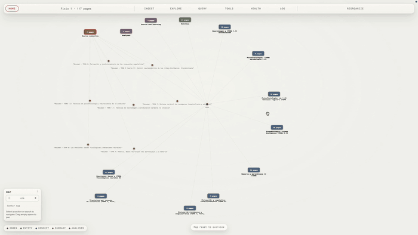

# Eva — LLM Brain


Eva is an open-source, local-first desktop app for building a personal
knowledge base with an LLM. Instead of repeatedly retrieving from raw
documents at question time, Eva helps an agent maintain a durable, linked
Markdown brain between the sources and the user.



*Navigating a real 117-page brain: selecting a source summary highlights every
concept it supports, then a section cluster expands into its pages.*

## Platform support

Eva V1 intentionally targets macOS only. Tauri itself supports Windows and
Linux, but neither platform has been built or tested against this codebase;
expanding support is a deliberate future product decision, not an oversight.

The versioned on-disk and operational contract is the
[`Eva Brain Standard v1`](docs/EVA_BRAIN_STANDARD.md). Its `eva.json` marker
lets Eva identify a compatible brain before it applies agent workflows, while
keeping sources, wiki pages, instructions, and local history portable across
tools.

- `packages/wiki-lib` — pure TypeScript frontmatter/wiki-link parsing, graph
  building, and deterministic structural linting. Includes a 16-page fixture.
- `packages/eva-mcp` — read-only MCP navigation tools for an agent: search,
  page reads, neighbors, and shortest paths.
- `apps/desktop` — Tauri v2 + Vite graph explorer plus Codex CLI and Claude
  Code adapters for worktree-isolated ingest, cited query, and read-only
  Health Check.
- `schema/` and `templates/vault/` — the Eva Brain Standard v1 marker,
  operating contract, and starter infrastructure seeded into an Eva-managed
  brain.

## Setup

```sh
npm install          # installs workspaces, builds wiki-lib via its prepare script
npm test             # wiki-lib unit tests (vitest)
npm run tauri dev    # launches the desktop app (requires Rust toolchain)
```

## Build and install locally

These instructions turn the source code in this checkout into an Eva app on
your own Mac. Use them when you prefer to inspect and build the code yourself
instead of trusting a prebuilt unsigned download. The process runs Eva's tests,
creates the app and disk image locally, and gives the app an ad-hoc signature
so you can check that the bundle has not changed before installation. It does
not identify a trusted publisher or notarize the app.

Install the locked dependencies, run both test suites, and build the local
bundle:

```sh
npm ci
npm test
cargo test --manifest-path apps/desktop/src-tauri/Cargo.toml
APPLE_SIGNING_IDENTITY=- npm run tauri build
```

The build prints the exact artifact paths. On Apple Silicon they are normally
under `apps/desktop/src-tauri/target/release/bundle/macos/Eva.app` and
`apps/desktop/src-tauri/target/release/bundle/dmg/`. While Tauri creates the
DMG, Finder may briefly show Eva beside an Applications shortcut so the build
script can arrange the disk image. Leave that window alone until the terminal
reports that the build has finished. Then record the source revision and
verify the application bundle before installing it:

```sh
git rev-parse HEAD
codesign --verify --deep --strict --verbose=2 \
  apps/desktop/src-tauri/target/release/bundle/macos/Eva.app
codesign --display --verbose=4 \
  apps/desktop/src-tauri/target/release/bundle/macos/Eva.app
xattr -p com.apple.quarantine \
  apps/desktop/src-tauri/target/release/bundle/macos/Eva.app
```

A successful `codesign --verify` confirms that the bundle has not changed
since it was signed. The display output for this local build says
`Signature=adhoc` and has no Team Identifier: it does not identify a trusted
publisher and is not a substitute for Developer ID signing or notarization.
The `xattr` command normally reports that a directly built app has no
quarantine attribute. If it does have one, check how the app was transferred
before removing it. Open the `bundle/macos` folder in Finder and drag the
verified `Eva.app` to `/Applications`.

The locally built app still needs Node.js and a signed-in Codex CLI or Claude
Code at runtime, as described below.

## Releases and installing

Tagged versions (`v*.*.*`) are built by GitHub Actions on macOS and published
as GitHub Releases with the `.dmg` attached; the newest build is always at
[releases/latest/download/Eva.dmg](https://github.com/jp-lorenc1o/Eva-brain/releases/latest/download/Eva.dmg).
To cut a release, bump the version in `apps/desktop/src-tauri/tauri.conf.json`
and push a matching tag.

**The app is not code-signed or notarized, and staying unsigned is a
deliberate V1 decision, not a stopgap.** Signing and notarization require
Apple Developer Program membership at $99/year; for a personal project at
this stage that cost is not justified. Revisiting it is a real decision to
make consciously later, not an assumed next step. The practical consequence:
browsers tag downloads with the quarantine attribute, and current macOS
reports a quarantined unsigned app as *"Eva" is damaged and can't be
opened* — right-click → Open does **not** get past this dialog. The app is
not damaged; clear the quarantine once and it opens normally:

```sh
xattr -cr /Applications/Eva.app   # adjust the path if Eva lives elsewhere
```

The released app still needs Node.js and a signed-in agent CLI on your Mac,
per the section below.

**Node.js is a hard runtime dependency of the ingest gate**, not just of the
build: the deterministic lint and the MCP navigation tools are Node scripts in
`packages/eva-mcp`, and ingest or saving an analysis refuses to run without
them. In dev they are found in the source checkout automatically; a bundled
Eva.app carries them as an app resource, staged by
`apps/desktop/scripts/bundle-tools.mjs` during `tauri build`. Set
`EVA_TOOLS_DIR=/path/to/packages/eva-mcp` to override the location in either
mode. Because apps launched from Finder do not inherit a terminal PATH, Eva
looks for `node`, `claude`, and `codex` on PATH plus `/opt/homebrew/bin`,
`/usr/local/bin`, and `~/.local/bin`, and reports a clear error when one is
missing.

## First brain

Choose **New brain** from the opening screen and name the knowledge project.
The setup sheet asks for a Brain Profile, working language, AI runtime, and
optional purpose; Eva stores that profile and its modules in `eva.json` and
`EVA.md`, creates a tailored linked starter page in
`~/Documents/Eva/Brains`, then opens the graph. Choose Codex or Claude Code;
Eva uses the CLI already signed in on the computer and never stores API keys or
credentials. Eva uses Git only locally to make reviews and undoable history
possible; it needs no GitHub account, remote, or Git identity. Select
**Ingest** to add the first source. Select **Query** to ask the maintained
brain a question; useful answers can be saved as a reviewable analysis page.
Use **Open brain** to choose from Eva's managed brain library. **Import a
brain** copies an external Markdown folder into `~/Documents/Eva/Brains` so it
joins that library without changing the original folder.

Use **Manage brains** to see each local folder and update its Brain Profile,
working language, AI runtime, or purpose. Eva records a profile change in that
brain's local Git history; it does not create an account, remote, or cloud
copy.

## Profile-aware work

Profiles change how Eva reads and maintains a brain. A research brain extracts
claims, evidence, and contradictions; a reading brain maintains chapters,
characters, and threads; a course brain tracks concepts, practice gaps, and
revision. Health checks use the same lens.

The **Tools** button appears whenever a brain is open. Results are always based
on the open brain, cite their supporting pages, and must be saved through Eva's
normal review flow. Course brains include **Flashcards** and a **Practice
exam** with an answer key; no API keys, account, or cloud upload is needed.

Those profile tools are suggestions, not walls: **Other tools** makes the full
tool library available in every brain. Every tool accepts an optional focus;
Flashcards can set a card count, and Practice exam can set its topics, question
count, and format (mixed, multiple choice, written, or short answer).

## Interface language

Eva can follow the system language or use a locally saved app-language choice:
English, Español, Português, Français, Deutsch, Italiano, 日本語, 한국어,
中文（简体）, and 中文（繁體）. This changes Eva's interface only; each brain keeps
its own independent working language.

## Health Check

**Health** combines deterministic structural linting with an optional,
read-only agent pass. The agent can flag evidence-backed contradictions, weak
provenance, stale claims, coverage gaps, and research questions. It never
edits pages, creates tasks, or commits changes.

## Privacy

Eva keeps every brain on the person's computer by default. It never creates a
Git remote or pushes sources, pages, or history anywhere. Eva copies selected
source files into a brain's `raw/` directory and records them in local history
only. Sharing or backing up a brain is an explicit choice the person makes
outside Eva.

Dev-only hooks (used for automated verification, no effect in production
builds): set `VITE_DEV_VAULT=/abs/path/to/vault` to auto-open a vault on
launch, and `VITE_DEV_SELECT=<page-id>` to auto-select a node. The app then
POSTs a render report to the vite dev server, which prints it to the terminal.

## License and contributing

Eva is open source under the [MIT License](LICENSE).

Issues and pull requests are welcome. Two things to know before contributing:
the V1 scope is deliberately macOS-only (see [AGENTS.md](AGENTS.md)), and
changes should keep the test suites green — `npm test` for wiki-lib and
`cargo test` in `apps/desktop/src-tauri` for the review-gate and vault logic.
